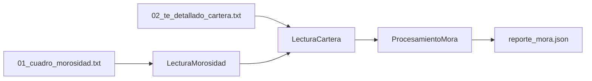

# Cobranzas

Job en Python con **arquitectura hexagonal** y **cadena de responsabilidad**. Procesa **2 archivos de entrada** (TAB) y genera un reporte JSON.

## Los 2 archivos de entrada

| Archivo | Formato | Contenido |
|---------|---------|-----------|
| `01_cuadro_morosidad.txt` | CUADRO DE MOROSIDAD - CONSOLIDADO | Operaciones en mora (`DIAS ATRASO`, saldo atrasado) |
| `02_te_detallado_cartera.txt` | TE DETALLADO DE CARTERA - CONSOLIDADO | Detalle de cartera (`DIAS MORA`, cédula, calificación) |

Salida: `reporte_mora.json`

## Flujo



1. **Morosidad** — carga operaciones en mora (fuente principal del filtro).
2. **Cartera** — enriquece por `NUMERO OPERACION` / `NO.OPERACION` (cédula, calificación, segmentación).
3. **Procesamiento** — filtra mora y genera el reporte.

## Carpetas de ejecución

| Carpeta | Contenido |
|---------|-----------|
| `docsmora/` | Entradas (cuadro morosidad + TE cartera) |
| `destino/` | Salida (reporte JSON) |

```
docsmora/2026/05042026/cartera05042026b/
├── 01_cuadro_morosidad.txt
└── 02_te_detallado_cartera.txt

destino/2026/05042026/cartera05042026b/
└── reporte_mora.json
```

Ver `docsmora/README.md` y `destino/README.md`.

## Variables de entorno

```env
ARCHIVO_MOROSIDAD=docsmora/2026/05042026/cartera05042026b/01_cuadro_morosidad.txt
ARCHIVO_CARTERA=docsmora/2026/05042026/cartera05042026b/02_te_detallado_cartera.txt
ARCHIVO_SALIDA=destino/2026/05042026/cartera05042026b/reporte_mora.json
DIAS_MORA_MINIMO=30
```

## Ejecución

```bash
python main.py
```

## Tests

```bash
pytest
```

Fixtures con datos reales:
- `tests/fixtures/cuadro_morosidad_consolidado.txt`
- `tests/fixtures/te_detallado_cartera.txt`
