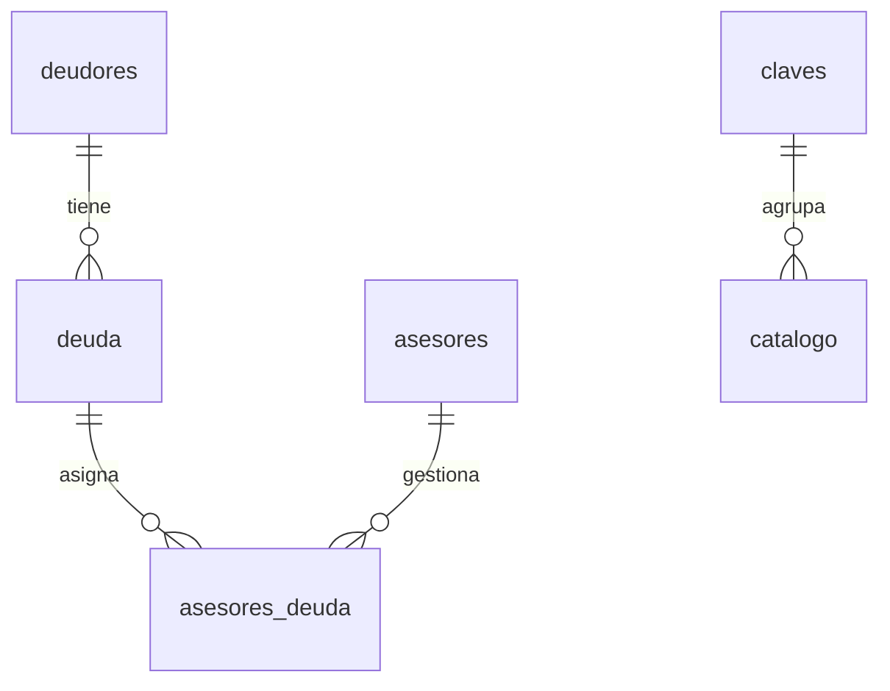

# ORM - BD_Cobranza (SQLite / SQL Server)

Entidades SQLAlchemy 2.0 en `src/cobranzas/infrastructure/persistence/models/`.

## Diagrama de relaciones

Archivos Mermaid (un diagrama por archivo para vista previa en VS Code):

| Archivo | Contenido |
|---------|-----------|
| [BD_Cobranza.mmd](BD_Cobranza.mmd) | Modelo ER tablas finales |
| [BD_Cobranza_staging.mmd](BD_Cobranza_staging.mmd) | Tablas temporales |
| [BD_Cobranza_pipeline.mmd](BD_Cobranza_pipeline.mmd) | Jobs y archivos |
| [BD_Cobranza_mapeo.mmd](BD_Cobranza_mapeo.mmd) | Mapeo .lis a deudor/deuda |

Visualizar en [mermaid.live](https://mermaid.live) o VS Code con extensión Mermaid.



## Tablas

| Modelo ORM | Tabla SQL | PK |
|------------|-----------|-----|
| `Asesor` | `asesores` | `id_asesor` |
| `Deudor` | `deudores` | `id_deudor` |
| `Deuda` | `deuda` | `id_deuda` |
| `AsesorDeuda` | `asesores_deuda` | `id_asesor_deuda` |
| `Clave` | `claves` | `id_clave` |
| `Catalogo` | `catalogo` | `id_catalogo` |
| `Regla` | `reglas` | `id_regla` |
| `LogAuditoria` | `logs_auditoria` | `id_log` |

## SQLite (desarrollo local)

1. Crear la base (una vez):

```powershell
.venv\Scripts\activate
python scripts/init_sqlite_db.py
```

2. Variables en `.env`:

```env
DATABASE_URL=sqlite:///data/BD_Cobranza.sqlite
PERSISTIR_EN_BD=true
```

3. Ejecutar el job (genera `.lis` y persiste deudores/deudas en mora):

```powershell
python main.py
```

DDL de referencia: `Sql_BD_Cobranza_sqlite.sql` (equivalente a `Sql_BD_Cobranza.sql` en SQL Server).

## Flujo en el backend

**Job 1 — Limpieza**

```
ProcesarCobranzasUseCase
  → LecturaMorosidadHandler
  → LecturaCarteraHandler
  → ProcesamientoMoraHandler (2 archivos .lis)
  → PersistenciaBDHandler (opcional)
        → PersistirCarteraMoraService
        → SqlAlchemyCobranzaRepository
```

**Job 2 — Staging** (`python main.py staging`)

```
CargarStagingUseCase → SqlAlchemyStagingRepository → tmp_stg_*
```

Modelos: `infrastructure/persistence/models/staging.py`

Al persistir cartera en mora (`PERSISTIR_EN_BD=true`) se escriben:

| Tabla | Origen en `Credito` |
|-------|---------------------|
| `deudores` | `cedula`, `nombre`, `socio` |
| `deuda` | `numero_operacion`, oficina, sector, tipo operación/destino, fechas, montos, calificación |
| `asesores` | `codigo_oficial` + `nombre_oficial` (o columnas TAB `oficial`, `nombre_oficial`) |
| `claves` + `catalogo` | Clave `CLASIFICACION_MORA` → valor `mora_leve` / `mora_grave` / `al_dia` |
| `asesores_deuda` | Montos (`total_atrasado`, `total_operacion`, `saldo_pendiente`), `estado_operacion`, fecha corte |

Mappers: `deuda_deudor_mapper.py`, `cobranza_credito_mapper.py`.  
Repositorio: `SqlAlchemyCobranzaRepository` (upsert por documento y número de operación).

### División deudor / deuda

| Origen (.lis) | Tabla | Columna BD |
|---------------|-------|------------|
| CEDULA | deudores | documento |
| NOMBRE | deudores | nombre |
| SOCIO | deudores | socio |
| NUMERO OPERACION | deuda | numero_operacion |
| OFICINA | deuda | oficina |
| DESC.OFICINA | deuda | descripcion_oficina |
| SECTOR | deuda | sector |
| TIPO OPER. | deuda | tipo_operacion |
| TIPO DEST. | deuda | tipo_destino |
| FECHA DE CONCESION | deuda | fecha_concesion |
| FECHA DE VENCIMIENTO | deuda | fecha_vencimiento |
| FECHA ULTIMO PAGO | deuda | fecha_ultimo_pago |
| VALOR ORI.PRESTAM | deuda | valor_original_prestamo |
| SALDO CAP. PREST | deuda | saldo_capital_prestamo |
| CALIFICAC | deuda | calificacion |
| TOTAL PROVISION | deuda | total_provision |
| SALDO (cap. préstamo) | deuda | saldo |

Si la BD ya existía: ejecutar `Sql_BD_Cobranza_alter_deuda_deudor.sql` (SQL Server) o borrar `data/BD_Cobranza.sqlite` y `python main.py init-db`.

## SQL Server (producción)

```env
DATABASE_URL=mssql+pyodbc://@localhost/BD_Cobranza?driver=ODBC+Driver+17+for+SQL+Server&trusted_connection=yes
PERSISTIR_EN_BD=true
```

Ejecutar antes `Sql_BD_Cobranza.sql` en SQL Server.

## Uso directo del ORM

```python
from cobranzas.infrastructure.config.settings import Settings
from cobranzas.infrastructure.persistence import (
    create_engine_from_settings,
    get_session_factory,
    init_database,
)
from cobranzas.infrastructure.persistence.models import Deuda

settings = Settings()
engine = create_engine_from_settings(settings)
init_database(engine)
SessionLocal = get_session_factory(engine)

with SessionLocal() as session:
    print(session.query(Deuda).count())
```
